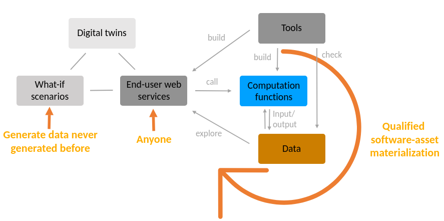
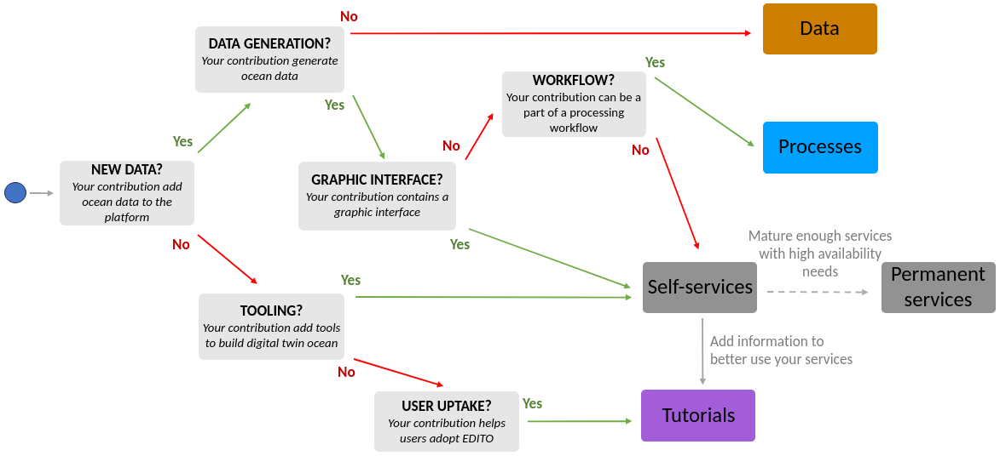

# How to start contributing?

This documentation provides detail on how to contribute to EDITO services, processes, data and metadata.

## Introduction and context

EDITO provides tool to explore and build the European digital twins of the Ocean.
The main challenge is to **allow anyone to generate data that have never been generated before**.
To do so, it focuses on three levels of interaction: the **services**, the **processes** and the **data**.
All of them are backed by API and graphical web interfaces, can seamlessly interact internally or easily integrated with external resources.

## EDITO services, processes and data

### Services

Services are long-life deployment serving interfaces (API or graphical web interfaces).
They are data science tool services or end-user focus applications.

### Processes

Processes are finite-time computation functions with inputs and produce new data as output.
They can be piped, scheduled, or trigger on-demand.
In opposite to services, they don't host a web server or UI.

### Data

Data are both metadata and data assets (the actual data). Metadata can reference data assets hosted in EDITO internal storage or reference data assets hosted in external infrastructures.
Metadata can also contain links to processes that generate the data assets.
This enables *(software-)asset materialization*, i.e. the on-demand generation of assets that have been previously defined in metadata but never created, fulfilling the digital twin challenge.

### Where to start?

The following figure provides some hints to understand how to give value to your first work on EDITO, by contributing either to the service layer, the process layer or the data layer.

Once you started to contribute to each layer independently, you are encouraged to exploit all EDITO layers to architect your contribution.

### How to architect you work?

Both service and processes types run on EDITO internal computing cluster.
However, using containers, they can rely on external resources (data, storage, computational resources) that should be hidden to end-user for simplicity.
Moreover, enabling seamless direct run on external infrastructures is foreseen and currently evaluated.

The separation between services and processes is there for both your architectural need and for the reusability of your work.

For example, you could build an end-user application that launches your underlying processes with specific inputs, and then allows the end-user to explore the output data within the application.

Moreover, nothing prevents one process to launch others sub-processes in background.

In addition, be aware that you can "hide" several containers under a single service (hence, a single tile in the catalog UI).
In doing so, end-users have a single point of entry to launch and access your service even if, under the hood, your service relies on a database for example.

### Tutorials

Finally, you can also take advantage of the tutorial engine to create and host description/documentation pages, and to provide a "Run" button to directly launch your service with a particular configuration.

## Getting started

The service and process deployments rely on helm chart repositories versioned using Gitlab.
To get write access to public contributing repositories on Mercator Ocean Gitlab instance and/or be added to the support channel on Microsoft Teams, please contact the [support](mailto:edito-infra-dev@mercator-ocean.eu).

Check-out the following tutorials:

* [Add your own web application as a service](https://gitlab.mercator-ocean.fr/pub/edito-infra/helm-charts/playground)
* [Add your own computation as a process](https://gitlab.mercator-ocean.fr/pub/edito-infra/ocean-processes/)
* [Add your own tutorial](https://gitlab.mercator-ocean.fr/pub/edito-infra/edito-tutorials-content)
* [Understanding EDITO resources](https://gitlab.mercator-ocean.fr/pub/edito-infra/edito-tutorials-content/-/blob/master/articles/resources.md)
