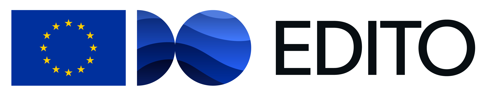
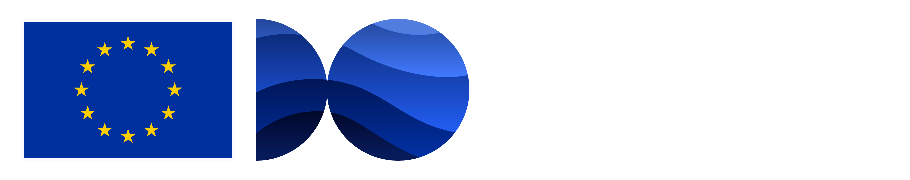
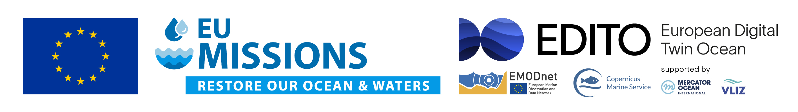
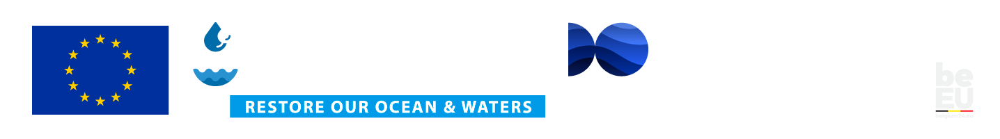

# EDITO brand style guide

If you run a service that partially or totally relies on EDITO, please consider crediting the platform as follows:

1. Add in the top left corner the following EDITO logo and EU flag, with the text above it: "Powered by":
- For light themes:

- For dark themes:

2. Add in the footer the full EU Digital Twin Ocean banner:
- For light themes:

- For dark themes:

